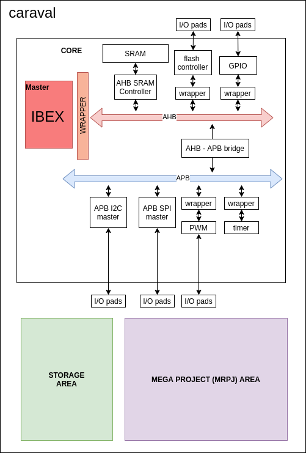
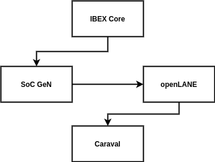
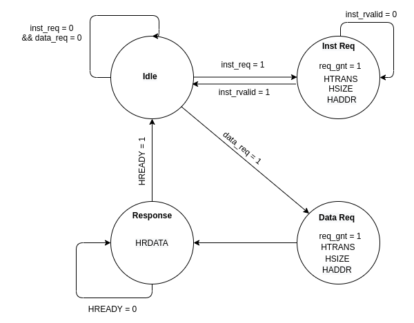
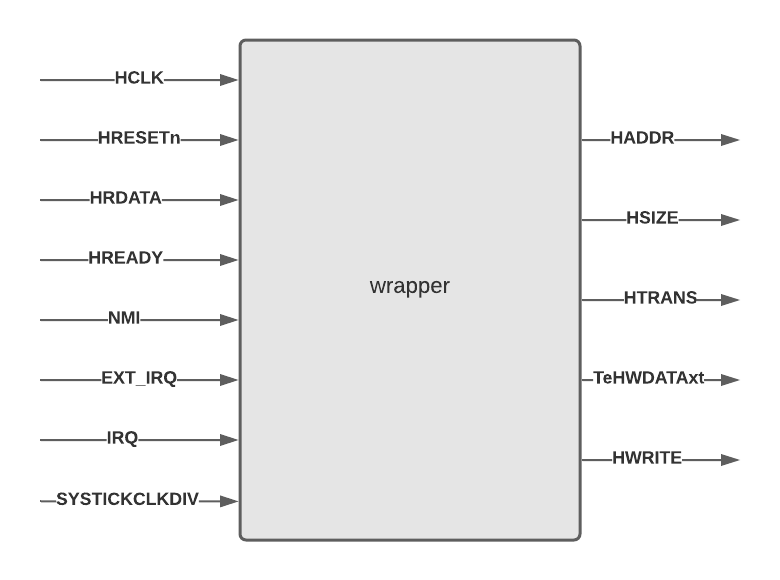
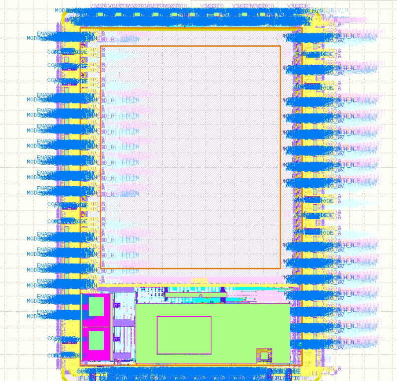
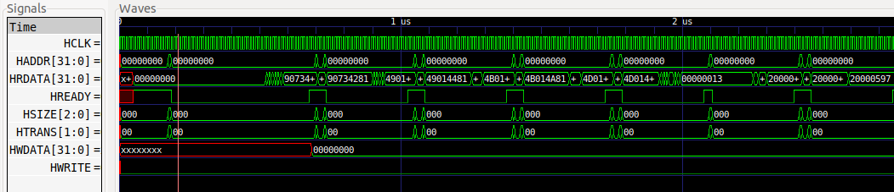

```
    ________  _______  __    _____       ______
   /  _/ __ )/ ____/ |/ /   / ___/____  / ____/
   / // __  / __/  |   /    \__ \/ __ \/ /     
 _/ // /_/ / /___ /   |    ___/ / /_/ / /___   
/___/_____/_____//_/|_|   /____/\____/\____/   

```


## Project Description:


This is an SoC based on IBEX, a riscV based core, built for *Digital Design 2 Course @ AUC*, to be submitted and manufactured by *Google Shuttle*.

It is designed entirely using open source EDA tools ... 

Design and process flow are detailed below


## SoC Architacture 

Just like the designing tools, the entire project is manfactured using opensource cores.

1. [IBEX Core](https://github.com/lowRISC/ibex)
2. AHB - APB bidge and system from [SoC GeN](https://github.com/habibagamal/SoC_Automation), discuessed in details in the tools section
3. IPs from [SoC GeN](https://github.com/habibagamal/SoC_Automation)
4.  [Caravel](https://github.com/efabless/caravel), a template SoC for Google SKY130 free shuttles




## Main Tools:

1. [SoC GeN](https://github.com/habibagamal/SoC_Automation)
2. [openLANE](https://github.com/efabless/openlane)
3. [Caravel](https://github.com/efabless/caravel)
4. [GTKwave](https://github.com/gtkwave/gtkwave)
5. [Icarus Verilog](http://iverilog.icarus.com/)
6. [magic](http://opencircuitdesign.com/magic/index.html)





## **Design Process** 


### **Preparing RTLs**
</br> 

In the [IBEX Core](https://github.com/lowRISC/ibex) repo, the entrie system is designed using SystemVerilog (IEEE 1800-2017). However, due to using iverilog and yosys for compilation and synthesis, we needed to convert it to Verilog (IEEE 1364-2005). 

Fortunately, IBEX repo includes a script to perform this conversion using [sv2v](https://github.com/zachjs/sv2v)


To perfom the conversion you would need to go to the */util* directoty inside IBEX repo. Then, you would need to insert the path of the standered cell library. In our project, in order to fit the Shuttle spacifications, we used the opensource [SKY130A](https://github.com/google/skywater-pdk) standrad cell library ... more detail on this in latter sections.

Also, our SoC is supposed to communicate with other components through AHB Bus Interface. So, we designed a **wrapper** to make our system compatible with AHB standard signals.

### **Wrapper description**

The wrapper's main mission was producing AHB compatible signals from our IBEX core. We did this through instantiating the core inside our wrapper and mapped its signals to AHB signals through the following FSM:



It mainly has four states: 
* idle
* data request
* instruction request
* waiting for the response

here is a quick description of the main AHB signals:

|Signal | Description |
|-------| ------------|
|HCLK   |clock singal |
|HRESETn| reset signal|
|HADDR  |the address to be used for the transfer|
|HSIZE|indicates the size of a data transfer. <br> 000 => byte <br> 001 => Half word <br> 010 => word|
|HTRANS| state of the transfare <br> 00 => idle <br> 01 => busy <br> 10 => NON SEQUENTIAL|
|HREADY|indicates previous transfer is complete|
|HRDATA|The slave output to the master|
|HWRITE| enable write to slaves|
|HWDATA| data to be written in slave|

<br>

you can find the full description of IBEX signals in their [documentation](https://ibex-core.readthedocs.io/en/latest/02_user/integration.html)



> you details of each signal could be found in the `new wrapper.v` in our src folder.

>Special thanks to our professor @shalan for helping us with it.

---

### **Generating the SoC**
</br> 

Aside from IBEX core, the entire SoC is generated using [SoC GeN](https://github.com/habibagamal/SoC_Automation). In order to generate the system, a description of the systems signals must be inserted in the "masters.json" file in SoC Gen. Then you would need to add a description of the needed SoC and the connected subsystems. You can find our work under .....

Then, you can generate the sytem using this command :

```
node ./src/sys_gen.js -soc ./systems/IBEX/Demo/demo.json -subsystem ./systems/IBEX/Demo/apb.json -IPlib ./IPs/IPs.json -mastersLib ./masters/masters.json -outDir ./IBEX/

```

Along with the generated system, [SoC GeN](https://github.com/habibagamal/SoC_Automation) generates a self checking testbench to test the entire system. in order to run them and view the result, you would need:

1. [Icarus Verilog](http://iverilog.icarus.com/)
2. [GTKwave](https://github.com/gtkwave/gtkwave)
3. Prebuilt [RISC‑V GCC Toolchain](https://www.sifive.com/software) from SiFive 


to run the testbenchs, run the following commands in order:

```
find . -name "*.v" > file.lst
iverilog -o ./ibex_system.vvp -c file.lst
vvp ibex_system.vvp
gtkwave real_dump.vcd
```

More on our test results in the test section

----
### **Hardening using OpenLANE**
</br> 

As detailed in [openLANE](https://github.com/efabless/openlane)'s documentations, each design needs a config file. So, we wrote our config file to make our hardened MACROS compatible with Caravel, and to reach the optimal hardening results. 

The config file is included in **** directory

we did some experimentations on the config.tcl file to find out the optimum configuration settings ...You can find different configurations trials in MS2 "Report.pdf" where we have a table with different options and the corresponding results. 


just like the output of any hardened design using openlane, this was the structure of the output:

```
designs/IBEX_SoC
├── config.tcl
├── pdn.tcl
├── pin_order.cfg
├── src
|   ├── src files ...
├── runs
│   ├── <tag>
│   │   ├── config.tcl
│   │   ├── logs
│   │   │   ├── cts
│   │   │   ├── floorplan
│   │   │   ├── magic
│   │   │   ├── placement
│   │   │   ├── routing
│   │   │   └── synthesis
│   │   ├── reports
│   │   │   ├── cts
│   │   │   ├── floorplan
│   │   │   ├── magic
│   │   │   ├── placement
│   │   │   ├── routing
│   │   │   └── synthesis
│   │   ├── results
│   │   │   ├── cts
│   │   │   ├── floorplan
│   │   │   ├── magic
│   │   │   ├── placement
│   │   │   ├── routing
│   │   │   └── synthesis
│   │   └── tmp
│   │       ├── cts
│   │       ├── floorplan
│   │       ├── magic
│   │       ├── placement
│   │       ├── routing
│   │       └── synthesis
```


----
### **Integerating with Caraval**
</br> 
#### **Getting started** 

We started by cloning the repo and uncompressing the files.
```
git clone https://github.com/efabless/caravel.git
cd caravel
make uncompress
```

As spacified by *Caravel's documentation*,  our project is inserted into `user_project_wrapper` sub-directory. Then, the hardened SoC MACRO is integered with the caravel template. 

here is an image from the hardened caravel before inseting our design:



> **NOTE**: currently, caravel is a *WIP*, so there is a number of magic DRC with the final output. 


----
### **Tests & Results**

#### **design verification**:

Our design was tested by the self-checking testbench generated by SoC Gen. It was basically reading riscV instructions and performing reading from memory, perfoming operation over the data, and writing back to memory. 

here is a sample of the test result:
 
```
Mem request (0) A:0000069c
Mem request (0) A:0000068c
Mem request (0) A:2000fff8
Mem request (0) A:00000690
Mem request (0) A:00000694
Mem request (1) A:2000fff8
PWM Test Passed
```
The result of the entire test is included in the `/tests` sub-directory.

SoCGen included a number of systems and *N5-based-SoC* was the closet to our *IBEX-based-SoC*. So, we used it as a golden model to check the correction of our model.

Here is a screenshot of the waveform generated by our system:



to view the tests, just follow the steps mentioned in the *Generating the SoC* Section


